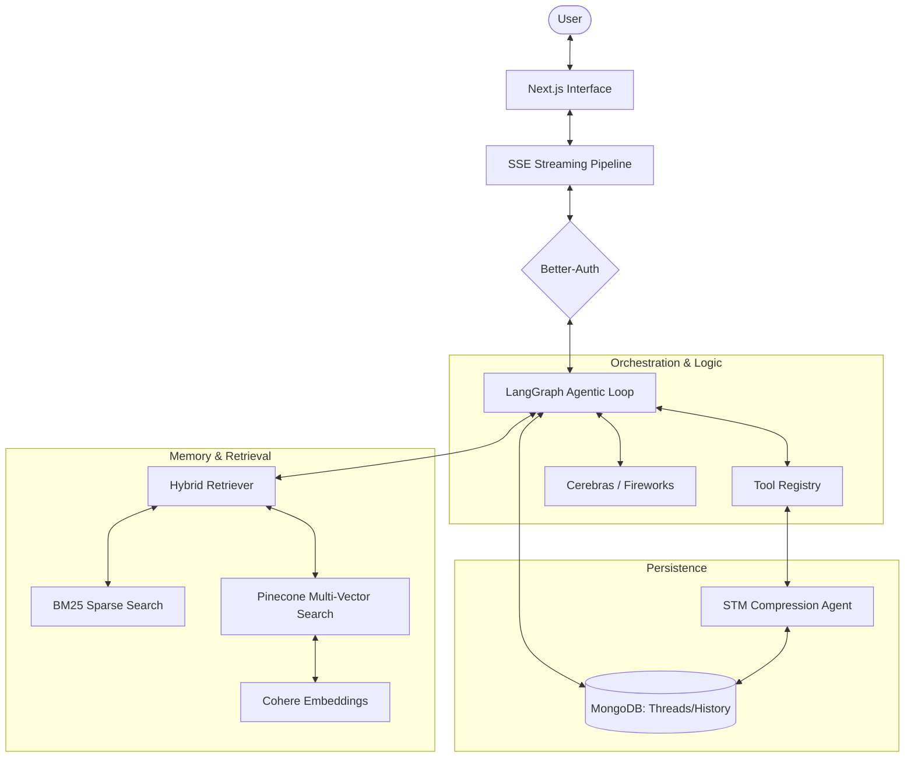

# Lunex AI Technical Documentation

## Overview
Lunex AI is an autonomous agentic system designed for task delegation rather than simple conversation. It utilizes a sophisticated stack of LLMs, vector databases, and orchestrated workflows to perform autonomous browsing, coding, and research.

## System Design and Application Flow

### Architecture Overview
The application follows a modular architecture where the frontend (Next.js) communicates with an orchestrated backend (LangGraph) via a real-time streaming pipeline.

### Detailed Application Flow

1. **Request Initiation**: The user sends a prompt via the Next.js interface. The request is passed through the SSE pipeline to maintain a persistent connection for streaming.
2. **Authentication and Session Management**: Better-Auth validates the user's session. The request is rejected if the JWT is invalid or expired.
3. **Context Retrieval (Hybrid Approach)**:
    - **BM25 Search**: The system performs a keyword-based search to find exact matches in the local "Daily Log Archive".
    - **Vector Search**: Simultaneously, the query is embedded via Cohere and searched against Pinecone child chunks.
    - **Context Expansion**: Any child chunk matches are mapped to their parent documents (2000 tokens) to ensure the LLM has complete context.
4. **Agentic Loop (LangGraph)**:
    - The retrieved context and user prompt are fed into the LangGraph state machine.
    - The LLM (Cerebras) decides whether to invoke tools (e.g., memory compression, history updates) or respond directly.
    - If reasoning is required, "thinking" tokens are generated and streamed to the UI's thinking panel.
5. **Streaming and Response Generation**:
    - Final tokens are streamed through the SSE pipeline.
    - On the client side, the Typewriter Buffer ensures smooth rendering.
    - Heartbeat signals prevent the connection from timing out during long reasoning tasks.
6. **Background Persistence and Maintenance**:
    - The conversation is saved to MongoDB (threads and messages collections).
    - Periodic triggers invoke the STM Compression Agent to summarize the day's events, which are then indexed into the long-term memory store.

## Core Architecture

### Framework and Orchestration
- **Next.js 15+ (App Router)**: Core application framework.
- **LangChain & LangGraph**: Orchestration layer for agentic loops, tool calling, and state management.
- **Better-Auth**: Secure session and authentication management.

### AI Model Layer
- **Cerebras**: Primary high-speed LLM provider (Llama 3.1 8b/70b).
- **Fireworks AI**: Secondary LLM provider for specialized tasks.
- **Cohere**: Provider for high-quality embeddings (embed-english-v3.0).

## Persistence and Storage

### Relational / Document Data
- **MongoDB**: Used for storing persistent chat threads, historical messages, and user metadata.
- **Mongoose**: Object modeling for MongoDB.

### Data Models (MongoDB)
- **User**: Managed via Better-Auth, stored in the `users` collection.
- **Thread**: Represents a conversation session, stored in the `threads` collection.
- **ChatHistory**: Stores individual messages (user/ai), thinking blocks, and metadata in the `chathistories` collection.

## Memory Systems

### Short-Term Memory (STM) Compression
- **Compression Agent**: A specialized LLM workflow that transforms raw daily chat logs into dense summaries.
- **Noise Reduction**: Removes reasoning traces, system prompts, and metadata to preserve only core facts and narrative summaries.

### Retrieval Mechanisms
- **BM25 Retriever**: Sparse retrieval for keyword-based search within documents. Highly effective for finding specific terms like "Daily Log Archive".
- **Multi-Vector Retriever**: Hybrid approach using Pinecone for dense retrieval.
    1.  **Search**: Child chunks (400 tokens) are searched for semantic similarity.
    2.  **Mapping**: Hits are mapped back to their Parent IDs.
    3.  **Expansion**: The full Parent context (2000 tokens) is retrieved to provide the LLM with enough surrounding information.
- **Contextual Compression**: Uses LLM-based extraction (LLMChainExtractor) to refine retrieved documents, ensuring only relevant snippets are passed to the final agent prompt.

## Implementation Details

### Streaming Pipeline
- **SSE (Server-Sent Events)**: Robust streaming with heartbeat signals (15s intervals) to prevent connection timeouts.
- **Typewriter Buffer**: Client-side character queue to ensure smooth, human-like rendering of AI responses regardless of network jitter.

### Dependency Management
- **Zod Versioning**: Forced resolution of Zod to version 4.x via npm overrides to ensure compatibility between Better-Auth and LangChain modules.

## Recent Milestones
- Migration of chat history from local files to MongoDB.
- Implementation of the BM25 keyword retriever.
- Deployment of the Parent-Child document indexing pipeline.
- Development of the Memory Compression Tool for long-term context retention.

## Design Rationale and Logical Considerations

### Why MongoDB over File-Based Storage?
- **Problem Solved**: Concurrent access and data reliability. File-based storage is prone to race conditions and corruption when multiple write operations occur simultaneously.
- **Impact of Absence**: Without MongoDB, the system would struggle to scale beyond a single user, and chat history would be at constant risk of being lost during server restarts or failed write cycles.

### Why Parent-Child Retrieval instead of Standard Vector Search?
- **Problem Solved**: The "lost in the middle" and context fragmentation issues. Standard vector search often retrieves small snippets that lack the surrounding context necessary for an LLM to form a complete answer.
- **Impact of Absence**: The agent would frequently receive incomplete information, leading to increased hallucinations or the need for more expensive, recursive retrieval steps.

### Why implement Memory Compression (STM Agent)?
- **Problem Solved**: Context window saturation and noise. AI agents generate significant "thinking" noise and redundant metadata that consumes expensive token space without adding value to long-term memory.
- **Impact of Absence**: The system would quickly hit token limits in long conversations, and the agent's performance would degrade as it attempts to process thousands of lines of irrelevant historical reasoning.

### Why Cerebras for Primary Inference?
- **Problem Solved**: Agentic latency. Autonomous agents require multiple sequential LLM calls (loops). Traditional providers with high time-to-first-token (TTFT) make these loops feel sluggish.
- **Impact of Absence**: The autonomous "delegation" experience would feel disconnected, with long wait times between every action and observation.

### Why NPM Overrides for Zod?
- **Problem Solved**: Incompatibility between production-grade libraries. Better-Auth and LangChain often trail behind each other in dependency updates, specifically regarding Zod versions.
- **Impact of Absence**: The project would suffer from persistent build failures or "missing module" errors, as seen in the transition to Zod 4.x.
