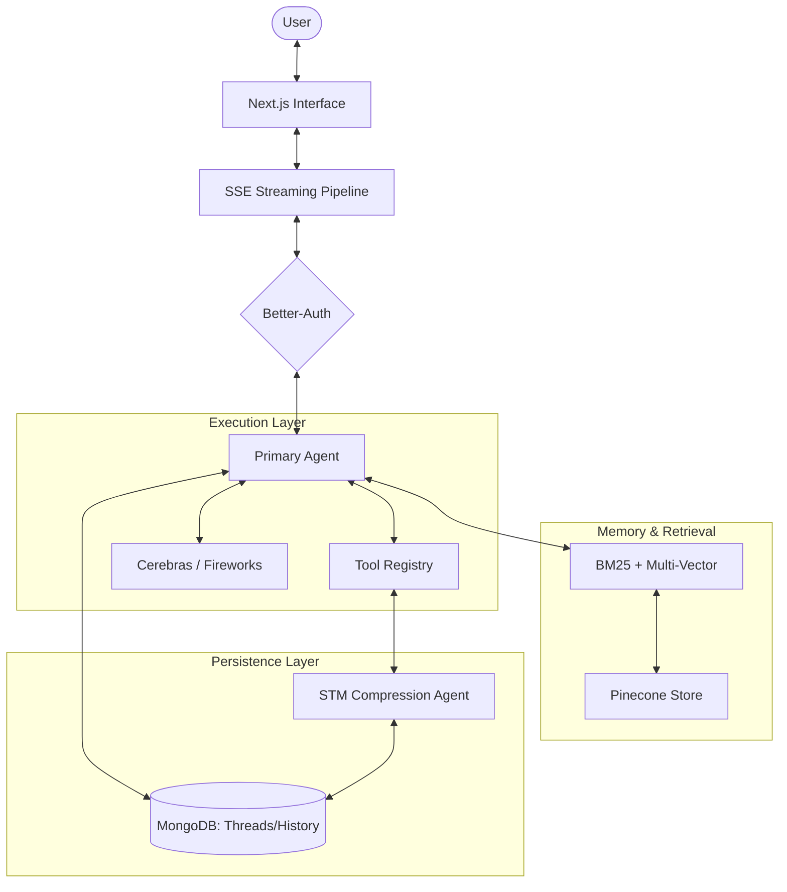

# Lunex AI Technical Documentation

## Current State Overview
Lunex AI is currently in the transition phase from a file-based prototype to a MongoDB-backed autonomous agent system. The project focuses on high-speed streaming interactions, hybrid memory retrieval, and structured thread management.

## Implemented Agents

### 1. Conversational Assistant (Primary Agent)
- **Role**: Handles direct user interaction, answering queries intelligently while maintaining context awareness.
- **Persona**: Calm, clear, composed, and professional.
- **Trigger**: Explicitly triggered by a `POST` request to the `/api/mongo/agent/streams`.
- **Implementation**: Uses `createAgent` with a custom `StateGraph` wrapper. Operates via the `model_request` node for clean conversational streaming.

### 2. Memory Compression Agent (STM Agent)
- **Role**: Specialized for summarizing raw conversation logs into dense, structured facts.
- **Persona**: A purely functional summarization engine optimized for long-term memory durability.
- **Trigger**: Currently exposed as a tool (`compressSTMTool`). It is invoked within agentic loops to process message batches.
- **Rules**: Removes reasoning traces, metadata, and timestamps to focus on stable user facts.

## System Design and Flow

### Detailed Execution Flow
1. **Request**: User prompt sent via Next.js to `/api/mongo/agent/streams`.
2. **Auth**: Session validated via Better-Auth.
3. **Retrieval**: System performs BM25 keyword search and Pinecone vector search. Child-to-Parent mapping ensures the LLM receives expanded context.
4. **Inference**: Primary Agent processes input. If a tool is required (e.g., updating thread title), it is executed before final response generation.
5. **Streaming**: SSE delivers tokens for both "thinking" and "message" channels.

## API Endpoints

### MongoDB Operations (Current Standard)
- **POST `/api/mongo/agent/streams`**: Streams AI response using MongoDB history.
- **GET `/api/mongo/agent/chat-history`**: Retrieves all messages for a specific thread.
- **POST `/api/mongo/threads`**: Creates a new thread.
- **GET `/api/mongo/threads`**: Lists all threads for a user.
- **PATCH `/api/mongo/threads`**: Renames a specific thread.
- **DELETE `/api/mongo/threads`**: Deletes a specific thread.

### File-Based Operations (Legacy)
- **POST `/api/agent/streams`**: Streams AI response using local JSON history.
- **POST/GET/PATCH `/api/threads`**: Management of threads stored in `public/chat-history`.

## Tool Registry

### Thread & History (MongoDB)
- **create_mongo_thread**: Initializes threads and manages activation state.
- **read_mongo_threads**: Syncs and retrieves thread lists.
- **write_to_mongo_chat_history**: Saves user/AI message pairs with optional reasoning blocks.

### Memory & Retrieval
- **write_memory**: Encapsulates the multi-vector storage pipeline (Parent splitting + Child embedding) for long-term fact storage in Pinecone.
- **search_long_term_memory**: Triggers semantic retrieval with contextual compression, allowing the agent to "remember" details from previous conversations.
- **update_user_info**: Directly modifies the persistent session state to track identity (e.g., name, role).
- **read_thread_history**: Direct MongoDB access for retrieving full conversation context of a specific thread.
- **BM25 Retriever**: Keyword-based search in local log archives for rapid, non-semantic lookups.

## Design FAQs

### Why MongoDB over File-Based Storage?
- **Problem Solved**: Concurrent access and data reliability. File-based storage is prone to race conditions and corruption when multiple write operations occur.
- **Impact of Absence**: Data loss becomes frequent, and the system cannot scale to multiple simultaneous users.

### Why Parent-Child Retrieval?
- **Problem Solved**: Context fragmentation. Standard vector search retrieves small snippets that lack surrounding detail.
- **Impact of Absence**: The agent often receives incomplete information, increasing the likelihood of hallucinations.

### Why Cerebras for Primary Inference?
- **Problem Solved**: Agentic loop latency. Multiple sequential LLM calls are required for delegation tasks; high-speed inference (Cerebras) is critical to keeping the interaction fluid.
- **Impact of Absence**: The "delegation" experience feels sluggish, with long gaps between actions and results.

### Why implementation of Memory Compression?
- **Problem Solved**: Context window saturation. Raw logs contain "thinking" noise and redundant metadata that consume token space.
- **Impact of Absence**: Long-term performance degrades as the agent attempts to process thousands of lines of irrelevant historical reasoning.

### Why NPM Overrides for Zod?
- **Problem Solved**: Versioning deadlock between Better-Auth and LangChain.
- **Impact of Absence**: The project fails to build or suffers from persistent runtime type errors.

## Future Tasks (Roadmap)
- **Autonomous Tooling**: Implementation of Browser and Coding tools (currently in development).
- **Automated Memory Triggers**: Dynamic logic to trigger memory "consolidation" based on token usage or thread completion.
- **Refining Retrieval Accuracy**: Improving the "Parent-Child" similarity thresholds to reduce noise in extremely large memory stores.
- **Multi-Agent Orchestration**: Expanding from a single memory-enabled agent to a swarm of specialized executors.
